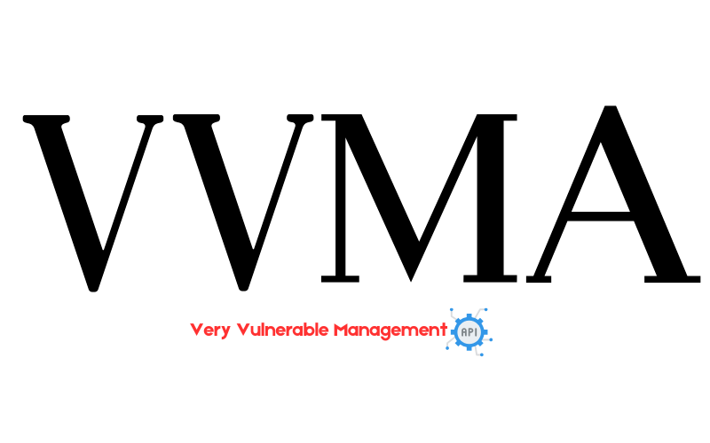

# VVMA
<p align="center">

</p>

Very Vulnerable Management API (VVMA) is an intentionally vulnerable RESTful API built with Node.js for educational and testing purposes. It is designed to help security professionals, developers, and learners understand and mitigate common API security risks. VVMA intentionally includes vulnerabilities from the OWASP Top 10 API Security Risks, allowing users to explore and test security flaws in user management, group management, and password reset systems.

It is a valuable resource for improving application security skills through hands-on practice and code review.

## Features 💡
### User Endpoints:
- Create a new user
- Retrieve user details
- Update user information
- Delete a user

### Group Endpoints:
- List all groups
- Retrieve a group by ID
- Create a new group (an invite code generated)
- Join groups (by ID or via invite URL)
- Refresh a group invite code
- Update group details (admins only)
- Delete a group (creator only)
- Manage group membership (remove/promote members)

### Password Reset Endpoints:
- Request password reset
- Verify OTP

## List of Vulnerabilities🐞
- Weak Password Policy
- Broken Authentication
- Broken Object Level Authorization (BOLA)
- Broken Function Level Authorization (BFLA)
- Weak JWT Implementation
- Broken Object Property Level Authorization (BOPLA)
- SQL Injection
- Weak Secret Key
- Email Enumeration
- Server-Side Request Forgery (SSRF)
- Improper Inventory Management 
- No Rate Limiting 
- Plaintext Password Storage

## Installation & Setup 🚀

### Using Docker Compose (Recommended)
Prerequisites
- Docker
- Docker compose

1. Clone the repository
```bash
git clone https://github.com/abigailajohn/VVMA.git
cd VVMA
```

2. Start the services
```bash
docker-compose up --build -d 
```
This will start the API, database, and MailHog.

3. Check running containers
```bash
docker ps
```
API Base URL: http://localhost:3000, Swagger Docs: http://localhost:3000/api-docs & MailHog UI: http://localhost:8025


### Using Docker only
You can use the pre-built Docker image (but we recommend using docker-compose):

1. Clone the repository
```bash
git clone https://github.com/abigailajohn/VVMA.git
cd VVMA
```

2. Build the image & Run the container
```bash
docker build -t vvma .
docker run -p 3000:3000 vvma 
```

### Local Installation
Follow these steps to set up the project locally:

Prerequisites
- Node.js 
- MySQL 8.0 
- MailHog

1. Clone the repository
```bash
git clone https://github.com/abigailajohn/VVMA.git
cd VVMA
```

2. Install dependencies
```bash
npm install
```

3. Set up the database:
Import the pre-populated database:
   
```bash
sudo mysql -u root -p < src/db/init.sql
```

3. Start MailHog
```bash
docker run -d -p 1025:1025 -p 8025:8025 mailhog/mailhog
```

4. Start the API
```bash
npm start
```

### Contributing 🤝
We welcome contributions to improve Very Vulnerable Management API (VVMA)! Whether you want to suggest new features, fix issues, or enhance documentation, your help is appreciated.


### Disclaimer ⚠️
This API is intentionally vulnerable and is meant solely for educational and testing purposes. Do not deploy this code in a production environment. The vulnerabilities demonstrated here are examples of what to avoid in secure coding practices.

## License
This project is released under the MIT License.
